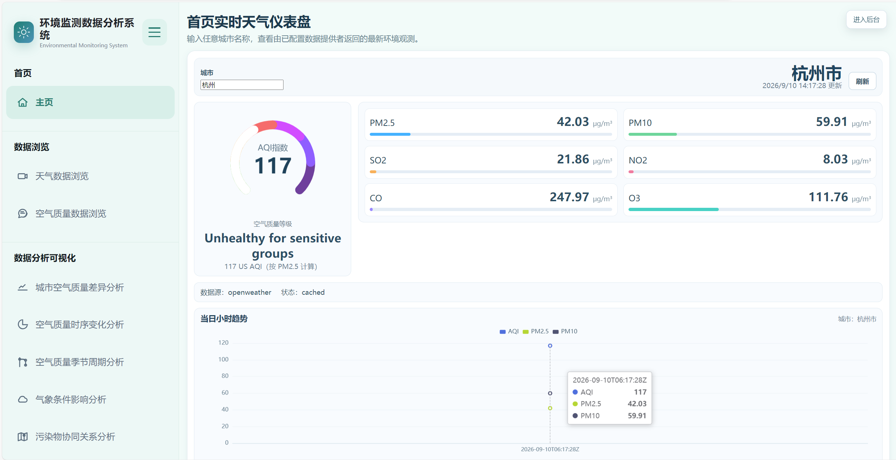

# Open Environment Monitor

[](https://github.com/kyoongoa/open-environment-monitor/actions/workflows/ci.yml)


[](LICENSE)

一个可二次开发的 Django + Vue 环境监测项目。它从开发者自行配置的第三方 Provider 获取当前天气与空气污染物浓度，将已验证的真实观测累积到数据库，并以 REST API 提供实时页面、历史数据与图表数据。

## 项目预览



## Features

- OpenWeather Provider：当前天气、温湿度、风速、PM2.5、PM10、SO2、NO2、CO、O3。
- 明确的数据状态：`live`、`cached`、`stale_cache`；未配置或失败时返回 503，绝不伪造实时值。
- 内存缓存（默认 5 分钟），可在未来替换为 Redis；每条观测保存来源、观测时间和采集时间。
- 基于 `(city, observed_at)` 的唯一约束和 upsert，避免重复入库。
- Vue/ECharts 图表读取已积累的真实观测；空历史保持为空，不使用固定数组补点。

## Architecture

`Provider → validation/normalization → memory cache + MySQL → REST API → Vue dashboard/history/charts`

仓库不携带来源未确认的历史 CSV、数据库转储或训练产物。历史数据由应用运行期间成功获取的 Provider 观测持续积累；全新安装的历史图表为空是预期行为。

## Tech Stack

- Backend: Python 3.10+, Django 4.2, PyMySQL
- Frontend: Vue 3, Vite, Axios, ECharts
- Database: MySQL 8+（开发和 CI 可切换 SQLite）


## 快速开始

### 环境要求

- Python 3.9+
- Node.js 22+
- npm
- OpenWeather API Key

> 本项目已在 Python 3.9 本地环境运行验证，并在 GitHub Actions 的 Python 3.11 环境中通过自动化测试。

MySQL 不是必需项。为了让项目更容易本地启动，推荐首次运行时使用 SQLite，这样无需额外安装数据库服务。
使用 SQLite 时，数据库固定保存在 `backend/db.sqlite3`，无论从仓库根目录还是 `backend` 目录执行 Django 命令，都会使用同一文件。

### 1. 克隆项目

```bash
git clone https://github.com/kyoongoa/open-environment-monitor.git
cd open-environment-monitor

### 2. 配置环境变量

复制示例配置文件：

**Windows PowerShell**

```powershell
Copy-Item .env.example .env

### 3. 启动后端

在仓库根目录执行：

```bash
pip install -r backend/requirements.txt
python backend/manage.py migrate
python backend/manage.py runserver

### 4. 启动前端

另外打开一个终端。

**Windows PowerShell**

```powershell
cd frontend
npm.cmd ci
npm.cmd run dev

### 5. 验证实时数据

启动前后端后，可以在页面中输入例如：

```text
Beijing
北京
北京市
Hangzhou
杭州
杭州市
## Data Provider and Limitations

当前唯一运行时 Provider 是 OpenWeather，必须提供 API Key。它的空气污染 API 给出浓度和 1–5 分类；界面显示的 `US AQI` 只由 PM2.5 根据 EPA 断点计算，不是任何地区的官方综合 AQI。若 Key 缺失、城市不存在、网络故障或 Provider 返回无效 JSON，服务返回明确错误；若内存中有最后一次成功值，则返回 `stale_cache` 和时间戳。

Provider 请求有 12 秒超时、HTTP/JSON/null 校验；没有无限重试。缓存默认 300 秒，前端每 5 分钟重新请求，并在组件销毁时清理定时器。

## API

详见 [API 文档](docs/API.md)：

- `GET /api/environment/realtime/?city=北京`
- `GET /api/environment/history/?city=北京&limit=100`
- `GET /api/environment/trend/?city=北京`

原有 `api/auth` 路由保留登录和历史样本管理兼容性。新的环境 API 不依赖那些静态表。

## Database and Development

数据库结构由 Django migrations 创建；不要导入旧 `db.sql`，它包含历史用户数据且已从开源发布内容移除。开发检查：

```bash
python backend/manage.py check
python backend/manage.py test
cd frontend && npm run build
```

CI 使用 SQLite 且不调用真实 Provider，因此不会因外部服务而不稳定。

## Real Provider Verification

配置自己的 `OPENWEATHER_API_KEY` 后，可在本机运行以下可选 smoke test；它请求真实 Provider，验证必要字段，但绝不会打印 Key 或保存响应：

```bash
python scripts/smoke_test_provider.py Beijing
```

未配置 Key 时脚本会明确提示并以退出码 2 结束。这项手动验证不属于 CI。

## Contributing

提交前运行上述检查。Provider 扩展请实现 `EnvironmentDataProvider`，返回 `environment.py` 定义的标准化字段，并添加不访问网络的单元测试。

## License

This project is licensed under the MIT License. See [LICENSE](LICENSE).
